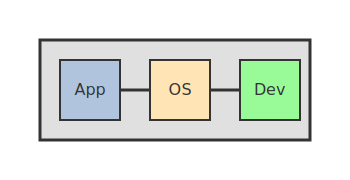

# Computer Science Core Concepts 

This repository provides an advanced overview of core computer science concepts, including in-depth explanations, technical diagrams, and references for further research. It is suitable for advanced learners, interview preparation, and professionals seeking a deeper understanding.

---

## Table of Contents

1. [Hardware](#hardware)
2. [Software](#software)
3. [Server](#server)
4. [Computation / Processor / CPU](#computation--processor--cpu)
5. [RAM](#ram)
6. [ROM / Storage](#rom--storage)
7. [Network](#network)
8. [Operating System](#operating-system)
9. [X-86](#x-86)
10. [ARM](#arm)
11. [RISC V](#risc-v)
12. [CISC](#cisc)
13. [CLI](#cli)
14. [Linux](#linux)
15. [Ubuntu](#ubuntu)
16. [Terminal](#terminal)
17. [GUI](#gui)
18. [Cloud Computing](#cloud-computing)
19. [AWS](#aws)
20. [Open Source](#open-source)
21. [Kernel](#kernel)
22. [AI](#ai)
23. [Directory / Folder](#directory--folder)

---

## 1. Hardware 
Hardware refers to the physical components of a computer system, including the CPU, RAM, motherboard, storage devices, buses, and peripheral devices. Advanced topics include:
- **Motherboard architecture** (chipsets, buses, expansion slots)
- **CPU sockets and compatibility**
- **Power delivery and thermal management**
- **Peripheral interfaces** (PCIe, USB, SATA, NVMe)

## 2. Software
Software includes system software (operating systems, device drivers), application software, and development tools. Advanced concepts:
- **Virtualization and containers**
- **Software architecture patterns** (MVC, microservices)
- **Compiler and interpreter design**
- **Software lifecycle and DevOps**

## 3. Server
A server is a system that provides resources, data, or services to clients over a network. Advanced server topics:
- **Load balancing and clustering**
- **High availability and failover**
- **Virtualization (hypervisors, containers)**
- **Security (TLS, firewalls, intrusion detection)**

## 4. Computation / Processor / CPU
The CPU (Central Processing Unit) is responsible for executing instructions and performing calculations. Advanced CPU topics:
- **Pipelining, superscalar, and out-of-order execution**
- **Branch prediction and speculative execution**
- **Cache hierarchy (L1, L2, L3)**
- **SIMD, MIMD, and parallelism**
- **Instruction set architectures (ISA)**

## 5. RAM
Random Access Memory (RAM) is volatile memory used for temporary data storage. Advanced RAM topics:
- **DDR generations (DDR3, DDR4, DDR5)**
- **ECC (Error-Correcting Code) RAM**
- **Memory channels and bandwidth**
- **Latency and timing (CAS, RAS)**

## 6. ROM / Storage
ROM (Read-Only Memory) stores firmware, while storage devices (HDD, SSD, NVMe, SAN) provide persistent data storage. Advanced storage topics:
- **RAID levels and redundancy**
- **File systems (NTFS, ext4, ZFS, Btrfs)**
- **Storage protocols (SATA, NVMe, SCSI, iSCSI, Fibre Channel)**
- **Wear leveling and TRIM in SSDs**

## 7. Network
Networks connect computers and devices to share resources and data. Advanced networking topics:
- **OSI and TCP/IP models (detailed layer functions)**
- **Subnetting, CIDR, and VLANs**
- **Routing protocols (OSPF, BGP, RIP)**
- **Network security (VPN, firewalls, IDS/IPS)**
- **Wireless standards (802.11, WPA3)**
- **SDN (Software Defined Networking)**

**Key Terms:**
- **ISP**: Internet Service Provider
- **IP / Standards**: Internet Protocols (IPv4, IPv6)
- **IPv6**: Newer version of IP addressing
- **APIPA (169.x.x.x)**: Automatic Private IP Addressing
- **Public IP (e.g., 192.168.x.x)**: Routable on the internet
- **Private IP**: Used within local networks
- **Local-Host (127.0.0.1)**: Refers to the local machine
- **LAN**: Local Area Network
- **MAN**: Metropolitan Area Network
- **WAN**: Wide Area Network
- **Internet**: Global network of networks
- **Intranet**: Private network within an organization
- **NIC**: Network Interface Card
- **Router**: Directs data between networks
- **Modem**: Modulates and demodulates signals for internet access
- **MAC Address**: Unique identifier for network interfaces
- **DNS**: Domain Name System, translates domain names to IP addresses
- **Packet**: Unit of data transmitted over a network
- **OSI Layers**: Open Systems Interconnection model, 7 layers for network communication

## 8. Operating System
An operating system (OS) manages hardware, software resources, and provides services for applications. Advanced OS topics:
- **Kernel architectures (monolithic, microkernel, hybrid)**
- **Process scheduling and concurrency**
- **Memory management (paging, segmentation, virtual memory)**
- **File system management and journaling**
- **Security (user permissions, sandboxing, SELinux, AppArmor)**

## 9. X-86
x86 is a family of CISC instruction set architectures based on the Intel 8086 CPU. Advanced x86 topics:
- **Protected mode and real mode**
- **SIMD extensions (MMX, SSE, AVX)**
- **Microcode and instruction pipelining**
- **Backward compatibility and legacy support**

## 10. ARM
ARM is a RISC architecture widely used in mobile, embedded, and increasingly server environments. Advanced ARM topics:
- **ARMv8, ARMv9, and TrustZone**
- **Big.LITTLE architecture**
- **Instruction pipelining and out-of-order execution**
- **ARM vs x86 performance and power efficiency**

## 11. RISC V
RISC-V is an open standard RISC instruction set architecture. Advanced RISC-V topics:
- **Custom instruction extensions**
- **Open hardware and ecosystem**
- **RISC-V privilege levels and security**
- **Comparison with ARM and x86**

## 12. CISC
CISC (Complex Instruction Set Computing) CPUs have many specialized instructions. Advanced CISC topics:
- **Microprogramming**
- **Instruction decoding and execution**
- **CISC vs RISC trade-offs**

## 13. CLI
The Command Line Interface (CLI) is a text-based interface for interacting with computers. Advanced CLI topics:
- **Shell scripting (Bash, PowerShell, Zsh)**
- **Pipelines, redirection, and process control**
- **Remote access (SSH, SCP, SFTP)**
- **Automation and DevOps workflows**

## 14. Linux
Linux is an open-source family of Unix-like operating systems. Advanced Linux topics:
- **Kernel compilation and customization**
- **Systemd and init systems**
- **Package management (APT, YUM, Pacman)**
- **Security (SELinux, AppArmor, firewalls)**

## 15. Ubuntu
Ubuntu is a popular Linux distribution based on Debian. Advanced Ubuntu topics:
- **LTS vs non-LTS releases**
- **Snap and Flatpak packaging**
- **Server vs desktop editions**
- **Cloud and container deployments**

## 16. Terminal
A terminal is a program that provides a CLI for interacting with the OS. Advanced terminal topics:
- **Terminal multiplexers (tmux, screen)**
- **Unicode and encoding support**
- **Custom prompts and themes**
- **Remote terminals and SSH**

## 17. GUI
The Graphical User Interface (GUI) allows users to interact with devices using graphical elements. Advanced GUI topics:
- **GUI frameworks (Qt, GTK, Electron, WPF)**
- **Accessibility and internationalization**
- **Event-driven programming**
- **UI/UX design principles**

## 18. Cloud Computing
Cloud computing delivers computing services over the internet. Advanced cloud topics:
- **IaaS, PaaS, SaaS models**
- **Cloud orchestration (Kubernetes, Docker Swarm)**
- **Hybrid and multi-cloud architectures**
- **Cloud security and compliance**

## 19. AWS
Amazon Web Services (AWS) is a leading cloud platform. Advanced AWS topics:
- **EC2, S3, Lambda, and advanced services**
- **Infrastructure as Code (CloudFormation, Terraform)**
- **Security (IAM, KMS, VPC)**
- **Cost optimization and billing**

## 20. Open Source
Open source software allows anyone to inspect, modify, and enhance the code. Advanced open source topics:
- **Licensing (GPL, MIT, Apache, BSD)**
- **Community governance and contribution models**
- **Open source security and supply chain**

## 21. Kernel
The kernel is the core of an OS, managing resources and hardware-software communication. Advanced kernel topics:
- **Kernel modules and drivers**
- **Process and thread management**
- **Inter-process communication (IPC)**
- **Security and isolation (namespaces, cgroups)**

## 22. AI
Artificial Intelligence (AI) simulates human intelligence in machines. Advanced AI topics:
- **Machine learning (supervised, unsupervised, reinforcement)**
- **Deep learning (neural networks, CNNs, RNNs, transformers)**
- **Natural language processing (NLP)**
- **AI ethics and explainability**

## 23. Directory / Folder
A directory (folder) is an organizational unit in a file system. Advanced directory topics:
- **File system hierarchies (FHS, Windows, macOS)**
- **Permissions and ACLs**
- **Symbolic and hard links**
- **Mount points and network file systems (NFS, SMB)**

---

## Further Topics

- **DNS** (Domain Name System): Recursive and authoritative DNS, DNSSEC, zone transfers, caching, and attacks (DNS spoofing, cache poisoning)
- **VPN** (Virtual Private Network): Tunneling protocols (OpenVPN, IPSec, WireGuard), split tunneling, site-to-site vs remote access, security considerations

## References & Further Reading

- [Wikipedia: Computer Science](https://en.wikipedia.org/wiki/Computer_science)
- [How Computers Work (YouTube)](https://www.youtube.com/watch?v=OAx_6-wdslM)
- [OSI Model Explained](https://www.cloudflare.com/learning/ddos/glossary/open-systems-interconnection-model-osi/)
- [AWS Cloud Overview](https://aws.amazon.com/what-is-aws/)
- [Linux Kernel Documentation](https://www.kernel.org/doc/html/latest/)
- [RISC-V International](https://riscv.org/)
- [ARM Developer Resources](https://developer.arm.com/)
- [Open Source Initiative](https://opensource.org/)
- [Stanford CS 140: Operating Systems](https://web.stanford.edu/class/cs140/)
- [MIT 6.824: Distributed Systems](https://pdos.csail.mit.edu/6.824/)

---

---

*This document is intended for advanced educational purposes. Contributions and suggestions for further depth are welcome!*
